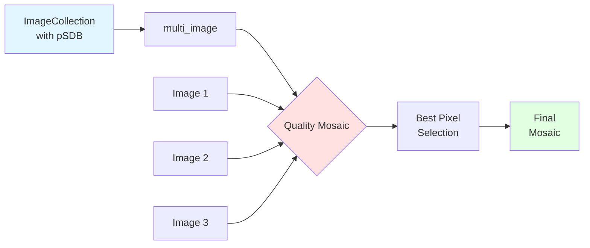
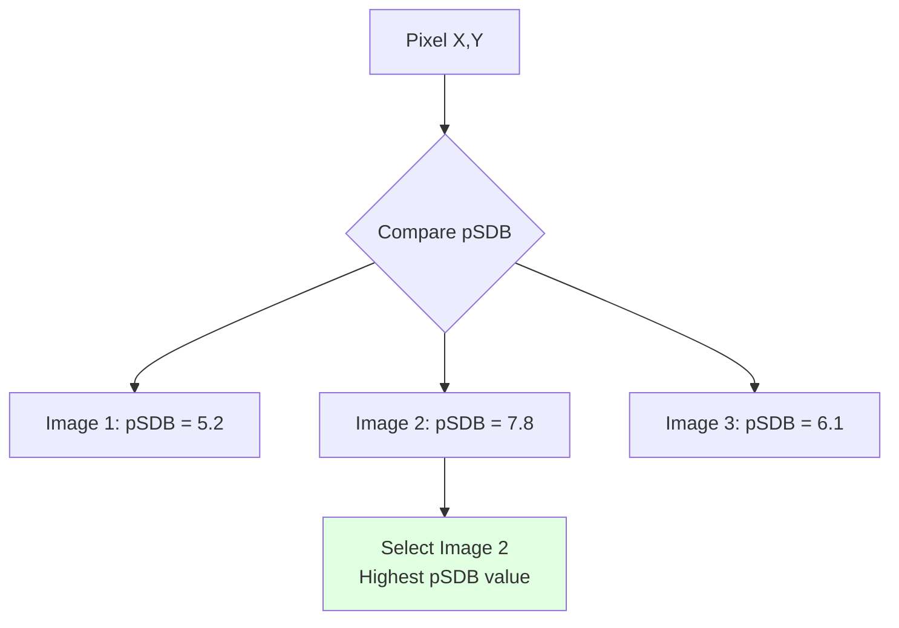
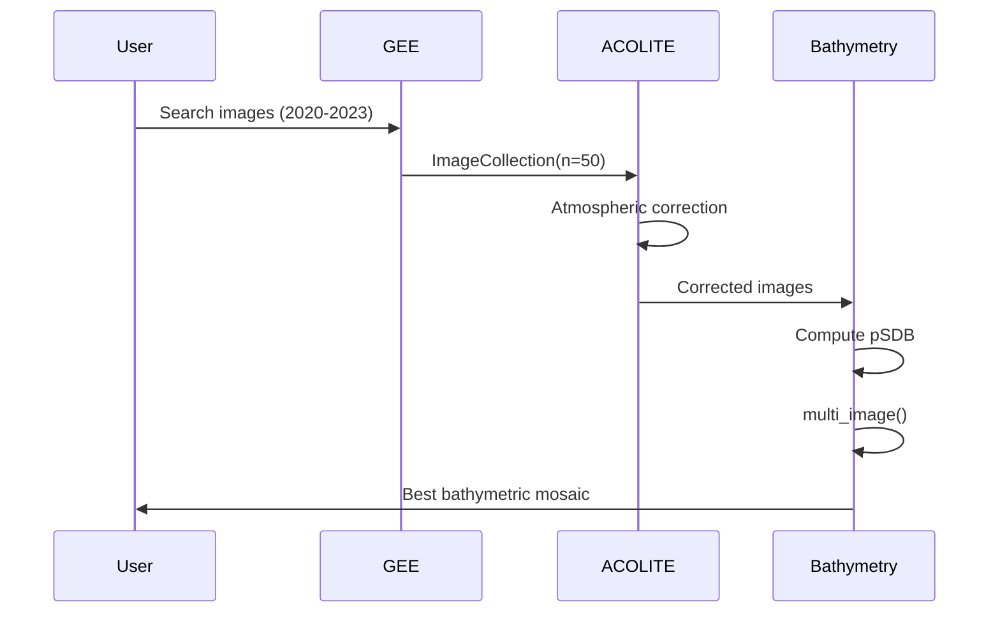

# Bathymetry

Utilities for satellite-derived bathymetry (SDB - Satellite-Derived Bathymetry) processing.

## General Description

The `gee_acolite.bathymetry` module provides functions to create quality mosaics from multiple satellite bathymetry images. It uses Google Earth Engine's `qualityMosaic` algorithm to select the best pixels based on the quality of the bathymetry band.

## Process Diagram



## Quality Mosaic Concept

The quality mosaic selects pixels from different images based on the value of a specific band:



## Functions

::: gee_acolite.bathymetry.multi_image
    options:
      show_root_heading: true
      show_source: true
      heading_level: 3

## Usage Example

```python
import ee
from gee_acolite.bathymetry import multi_image
from gee_acolite import ACOLITE

# Process multiple images with ACOLITE
corrected_images, settings = ac_gee.correct(images)

# Compute bathymetry for each image
def add_bathymetry(image):
from gee_acolite.water_quality import compute_water_bands

def add_bathymetry(image):
    return compute_water_bands(image, settings, products=['pSDB_green', 'pSDB_red'])

images_with_sdb = corrected_images.map(add_bathymetry)

# Create quality mosaic using green band
best_bathymetry = multi_image(images_with_sdb, band='pSDB_green')

# Visualize
Map.addLayer(best_bathymetry.select('pSDB_green'),
             {'min': -5, 'max': 0, 'palette': ['white', 'cyan', 'blue', 'navy']},
             'Bathymetry Green')
```

## Multi-Temporal Application



## Band Selection

The choice of band for the quality mosaic depends on the objective:

| Band | Recommended Use | Depth | Considerations |
|------|----------------|-------|----------------|
| `pSDB_green` | Clear waters | Up to ~25m | Greater penetration, better at medium depths |
| `pSDB_red` | Shallow waters | Up to ~8m | Better spatial resolution, very clear waters |
| `pSDB_blue` | Very clear waters | Up to ~30m | Greatest penetration, sensitive to CDOM |

## Advanced Example: Temporal Analysis

```python
import ee
import pandas as pd
from gee_acolite.bathymetry import multi_image

# Process images by year
years = [2020, 2021, 2022, 2023]
yearly_mosaics = {}

for year in years:
    # Search images for the year
    start = f'{year}-01-01'
    end = f'{year}-12-31'
    images_year = search(roi, start, end, tile='30SYJ')
    
    # Correct and compute bathymetry
    corrected, settings = ac_gee.correct(images_year)
    with_sdb = corrected.map(lambda img: compute_water_bands(
        img, settings, products=['pSDB_green', 'pSDB_red'])
    )
    
    # Create annual mosaic
    yearly_mosaics[year] = multi_image(with_sdb, band='pSDB_green')

# Analyze temporal changes
def extract_depth_profile(mosaic, line_geometry):
    """Extract depth profile along a line"""
    profile = mosaic.select('pSDB_green').reduceRegion(
        reducer=ee.Reducer.toList(),
        geometry=line_geometry,
        scale=10
    )
    return profile.getInfo()

# Extract profiles for each year
transect = ee.Geometry.LineString([[-0.35, 39.48], [-0.33, 39.48]])
profiles = {year: extract_depth_profile(mosaic, transect) 
            for year, mosaic in yearly_mosaics.items()}
```

## Bathymetry Validation

To validate satellite-derived bathymetry:

```python
import numpy as np
from sklearn.metrics import mean_squared_error, r2_score

def validate_sdb(predicted_depths, measured_depths):
    """
    Validate satellite-derived bathymetry against in-situ measurements.
    
    Parameters
    ----------
    predicted_depths : array-like
        Depths predicted by pSDB
    measured_depths : array-like
        Measured depths (e.g., echosounder)
    
    Returns
    -------
    dict
        Validation metrics (RMSE, R², bias)
    """
    rmse = np.sqrt(mean_squared_error(measured_depths, predicted_depths))
    r2 = r2_score(measured_depths, predicted_depths)
    bias = np.mean(predicted_depths - measured_depths)
    
    return {
        'RMSE': rmse,
        'R2': r2,
        'Bias': bias,
        'n_samples': len(predicted_depths)
    }

# Validation example
validation_points = ee.FeatureCollection('users/yourname/validation_points')

def extract_sdb_at_point(feature):
    point = feature.geometry()
    sdb_value = best_bathymetry.select('pSDB_green').reduceRegion(
        reducer=ee.Reducer.first(),
        geometry=point,
        scale=10
    ).get('pSDB_green')
    return feature.set('sdb_predicted', sdb_value)

validated = validation_points.map(extract_sdb_at_point)
```

## Technical Notes

### SDB Limitations

1. **Maximum depth**: Depends on water clarity and band used
2. **Bottom type**: Algorithms assume uniform/homogeneous bottom
3. **Water column**: Sensitive to turbidity, CDOM, chlorophyll
4. **Atmospheric correction**: Critical to obtain accurate Rrs

### Best Practices

- **Multiple images**: Use several years/dates for better coverage
- **Optimal conditions**: Low tide, calm waters, clear sky
- **Local calibration**: Adjust algorithm with in-situ data if available
- **Validation**: Always compare with reference data

## References

- Stumpf, R. P., Holderied, K., & Sinclair, M. (2003). Determination of water depth with high‐resolution satellite imagery over variable bottom types. Limnology and Oceanography, 48(1part2), 547-556.
- Lyzenga, D. R. (1978). Passive remote sensing techniques for mapping water depth and bottom features. Applied optics, 17(3), 379-383.
- Caballero, I., & Stumpf, R. P. (2020). Towards routine mapping of shallow bathymetry in environments with variable turbidity: Contribution of Sentinel-2A/B satellites mission. Remote Sensing, 12(3), 451.
