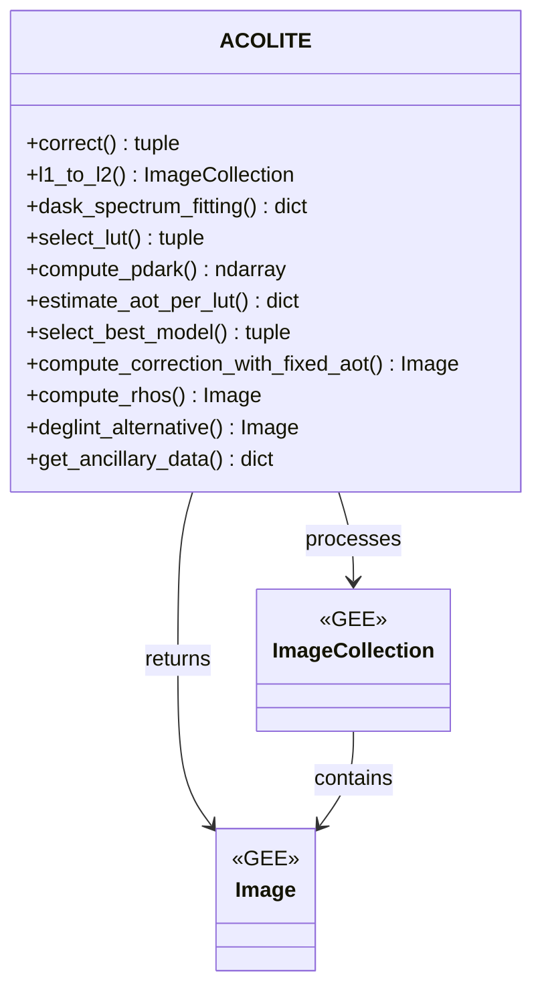
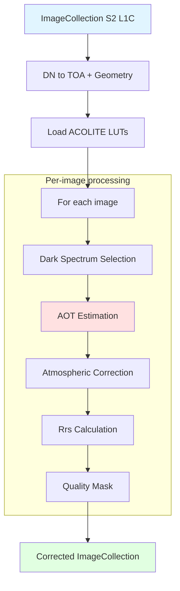

# Atmospheric Correction

Main module for atmospheric correction using the Dark Spectrum Fitting (DSF) method from ACOLITE.

## Overview

The `gee_acolite.correction` module implements the ACOLITE atmospheric correction optimized for Google Earth Engine. It uses the Dark Spectrum Fitting (DSF) method to estimate aerosol optical thickness (AOT) and correct atmospheric effects in Sentinel-2 images.

## Class Diagram



## Correction Flow




## ACOLITE Class

::: gee_acolite.correction.ACOLITE
    options:
      show_root_heading: true
      show_source: true
      heading_level: 3

## Usage Example

```python
import sys
sys.path.append('/path/to/acolite')

import ee
import acolite as ac
from gee_acolite import ACOLITE
from gee_acolite.utils.search import search

ee.Initialize(project='your-cloud-project-id')

ac_gee = ACOLITE(ac, {'s2_target_res': 10, 'dsf_spectrum_option': 'darkest'})

# Search for Sentinel-2 images
roi = ee.Geometry.Rectangle([-0.5, 39.3, -0.1, 39.7])
images = search(roi, '2023-06-01', '2023-06-30', tile='30SYJ')

# Apply atmospheric correction
corrected_images, settings = ac_gee.correct(images)

# Access corrected bands
first_image = corrected_images.first()
rrs_bands = ['Rrs_B1', 'Rrs_B2', 'Rrs_B3', 'Rrs_B4', 'Rrs_B5',
             'Rrs_B6', 'Rrs_B7', 'Rrs_B8', 'Rrs_B8A', 'Rrs_B11', 'Rrs_B12']
```

## Configuration

The method accepts a configuration file or dictionary with the following main parameters:

| Parameter | Type | Description | Default |
|-----------|------|-------------|---------|
| `s2_target_res` | int | Target spatial resolution in metres (10, 20, or 60) | 10 |
| `dsf_spectrum_option` | str | Dark spectrum method: `'darkest'`, `'percentile'`, `'intercept'` | `'darkest'` |
| `dsf_percentile` | float | Percentile when `dsf_spectrum_option='percentile'` | 1 |
| `dsf_nbands` | int | Number of darkest bands used for AOT fitting | 2 |
| `dsf_model_selection` | str | Model selection criterion: `'min_drmsd'`, `'min_dtau'`, `'taua_cv'` | `'min_drmsd'` |
| `dsf_fixed_aot` | float | Fixed AOT at 550 nm — skips DSF entirely if set | None |
| `dsf_fixed_lut` | str | LUT model name — required when `dsf_fixed_aot` is set | None |
| `pressure` | float | Atmospheric pressure (hPa) | 1013.25 |
| `wind` | float | Wind speed (m/s) | 3.0 |
| `uoz` | float | Total ozone column (cm-atm) | 0.3 |
| `uwv` | float | Atmospheric water vapour (g/cm²) | 1.5 |
| `l2w_parameters` | list[str] | Water quality products to compute after correction | [] |

## Technical Notes

### AOT Estimation

The DSF method estimates aerosol optical thickness (AOT) assuming that:

1. **Dark pixels**: There are pixels with very low surface reflectance (deep clear waters)
2. **Spectral relationship**: The reflectance of these pixels has a known spectral shape
3. **Least squares fitting**: The AOT that minimizes the difference between observed and modeled spectrum is found


### Look-Up Tables (LUTs)

ACOLITE uses pre-calculated LUTs with radiative transfer for:

- Downward atmospheric transmittance
- Upward atmospheric transmittance  
- Atmospheric path reflectance
- Diffuse radiance

The LUTs consider:

- Viewing geometry (solar and sensor angles)
- Aerosol properties (maritime/continental models)
- Atmospheric pressure
- Atmospheric gases (O₃, H₂O, O₂, etc.)

## References

- Vanhellemont, Q., & Ruddick, K. (2018). Atmospheric correction of metre-scale optical satellite data for inland and coastal water applications. Remote Sensing of Environment, 216, 586-597.
- Vanhellemont, Q. (2019). Adaptation of the dark spectrum fitting atmospheric correction for aquatic applications of the Landsat and Sentinel-2 archives. Remote Sensing of Environment, 225, 175-192.
