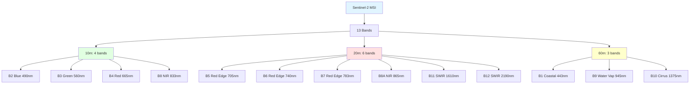

# Sentinel-2

Band configuration and definitions for the Sentinel-2 MSI sensor.

## Overview

The `gee_acolite.sensors.sentinel2` module defines constants and configurations specific to the MultiSpectral Instrument (MSI) aboard Sentinel-2A and Sentinel-2B.

## Sentinel-2 MSI Bands



## Defined Constants

::: gee_acolite.sensors.sentinel2.SENTINEL2_BANDS
    options:
      show_root_heading: true
      show_source: true
      heading_level: 3

::: gee_acolite.sensors.sentinel2.BAND_BY_SCALE
    options:
      show_root_heading: true
      show_source: true
      heading_level: 3

## Technical Specifications

### Complete Band Table

| Band | Name | Central λ (nm) | Width (nm) | Resolution | SNR | Primary Use |
|------|------|----------------|------------|------------|-----|-------------|
| B1 | Coastal aerosol | 442.7 | 21 | 60m | 129 | Atmospheric correction, aerosols |
| B2 | Blue | 492.4 | 66 | 10m | 154 | Ocean, bathymetry |
| B3 | Green | 559.8 | 36 | 10m | 168 | Vegetation, bathymetry |
| B4 | Red | 664.6 | 31 | 10m | 142 | Vegetation |
| B5 | Red Edge 1 | 704.1 | 15 | 20m | 117 | Vegetation classification |
| B6 | Red Edge 2 | 740.5 | 15 | 20m | 89 | Vegetation classification |
| B7 | Red Edge 3 | 782.8 | 20 | 20m | 105 | Vegetation classification |
| B8 | NIR | 832.8 | 106 | 10m | 174 | Biomass, vegetation indices |
| B8A | NIR Narrow | 864.7 | 21 | 20m | 72 | Water vapour |
| B9 | Water vapour | 945.1 | 20 | 60m | 114 | Water vapour correction |
| B10 | SWIR - Cirrus | 1373.5 | 31 | 60m | 50 | Cirrus detection |
| B11 | SWIR 1 | 1613.7 | 91 | 20m | 100 | Snow/cloud discrimination |
| B12 | SWIR 2 | 2202.4 | 175 | 20m | 100 | Soil moisture, geology |

### Spectral Response

```mermaid
graph LR
    A[400nm UV] --> B[443nm B1]
    B --> C[492nm B2]
    C --> D[560nm B3]
    D --> E[665nm B4]
    E --> F[704-783nm Red Edge]
    F --> G[833-865nm NIR]
    G --> H[945nm Water Vapor]
    H --> I[1374nm Cirrus]
    I --> J[1614-2202nm SWIR]
    J --> K[2400nm]

    style C fill:#0066ff
    style D fill:#00ff00
    style E fill:#ff0000
    style G fill:#990000
```



## Band Applications

### Water Quality and Bathymetry

```python
# Optimal bands for aquatic applications
WATER_BANDS = {
    'blue': 'B2',        # Deep penetration, bathymetry
    'green': 'B3',       # Balance of penetration/sensitivity
    'red': 'B4',         # Shallow waters, SPM
    'red_edge': 'B5',    # Chlorophyll, advanced algorithms
    'nir': 'B8',         # High turbidity, SPM
    'nir_narrow': 'B8A', # Water vapour, atmospheric correction
    'swir1': 'B11',      # Cloud/snow detection
}
```

### Vegetation Indices

```python
# NDVI (Normalized Difference Vegetation Index)
def calculate_ndvi(image):
    """NDVI = (NIR - Red) / (NIR + Red)"""
    nir = image.select('B8')
    red = image.select('B4')
    ndvi = nir.subtract(red).divide(nir.add(red)).rename('NDVI')
    return image.addBands(ndvi)

# EVI (Enhanced Vegetation Index)
def calculate_evi(image):
    """EVI = 2.5 * (NIR - Red) / (NIR + 6*Red - 7.5*Blue + 1)"""
    nir = image.select('B8')
    red = image.select('B4')
    blue = image.select('B2')

    evi = nir.subtract(red).multiply(2.5).divide(
        nir.add(red.multiply(6)).subtract(blue.multiply(7.5)).add(1)
    ).rename('EVI')
    return image.addBands(evi)
```

### Water Indices

```python
# NDWI (Normalized Difference Water Index)
def calculate_ndwi(image):
    """NDWI = (Green - NIR) / (Green + NIR)"""
    green = image.select('B3')
    nir = image.select('B8')
    ndwi = green.subtract(nir).divide(green.add(nir)).rename('NDWI')
    return image.addBands(ndwi)

# MNDWI (Modified NDWI)
def calculate_mndwi(image):
    """MNDWI = (Green - SWIR1) / (Green + SWIR1)"""
    green = image.select('B3')
    swir = image.select('B11')
    mndwi = green.subtract(swir).divide(green.add(swir)).rename('MNDWI')
    return image.addBands(mndwi)
```

## Resampling and Projection

```python
from gee_acolite.sensors.sentinel2 import BAND_BY_SCALE

def get_native_projection(scale):
    """
    Get the representative band for a given scale.

    Parameters
    ----------
    scale : int
        Target scale (10, 20, or 60 metres)

    Returns
    -------
    str
        Band name with that native resolution
    """
    return BAND_BY_SCALE.get(scale, 'B2')

# Example: resample all bands to 10m
target_scale = 10
reference_band = get_native_projection(target_scale)

def resample_to_10m(image):
    """Resample all bands to 10m."""
    proj = image.select(reference_band).projection()
    return image.resample('bilinear').reproject(crs=proj, scale=target_scale)
```

## S2A vs S2B Differences

Sentinel-2A and Sentinel-2B have slight calibration differences:

### Radiometric Offset

```python
# S2A/S2B harmonisation (simplified method)
def harmonize_s2(image):
    """
    Apply offset correction between S2A and S2B.
    Based on Roy et al. (2021).
    """
    # Identify satellite
    spacecraft = image.get('SPACECRAFT_NAME')

    # Offsets for S2B (S2A is the reference)
    offsets_s2b = {
        'B2': 0.0008,   # Blue
        'B3': -0.0001,  # Green
        'B4': -0.0017,  # Red
        'B8': -0.0022,  # NIR
        'B11': -0.0011, # SWIR1
        'B12': -0.0028  # SWIR2
    }

    # Apply offset if S2B
    def apply_offset(band_name):
        band = image.select(band_name)
        offset = offsets_s2b.get(band_name, 0)
        return ee.Image(
            ee.Algorithms.If(
                ee.String(spacecraft).equals('Sentinel-2B'),
                band.subtract(offset),
                band
            )
        ).rename(band_name)

    # Apply to all bands
    harmonized_bands = [apply_offset(b) for b in offsets_s2b.keys()]
    other_bands = image.select([b for b in image.bandNames().getInfo()
                                if b not in offsets_s2b.keys()])

    return ee.Image.cat(harmonized_bands + [other_bands]).copyProperties(image)
```

## RGB Visualisation

```python
# Common RGB composites

# True Colour
def true_color(image):
    """RGB: B4-B3-B2 (Red-Green-Blue)"""
    return image.select(['B4', 'B3', 'B2'])

# False Colour (NIR)
def false_color_nir(image):
    """RGB: B8-B4-B3 (NIR-Red-Green)"""
    return image.select(['B8', 'B4', 'B3'])

# False Colour (SWIR)
def false_color_swir(image):
    """RGB: B12-B8A-B4 (SWIR2-NIR-Red)"""
    return image.select(['B12', 'B8A', 'B4'])

# Agriculture
def agriculture(image):
    """RGB: B11-B8-B2 (SWIR1-NIR-Blue)"""
    return image.select(['B11', 'B8', 'B2'])

# Bathymetry
def bathymetry_rgb(image):
    """RGB: B4-B3-B2 with aggressive stretch for water."""
    rgb = image.select(['B4', 'B3', 'B2'])
    return rgb.multiply(3).clamp(0, 1)
```

## Comparison with Other Sensors

| Feature | Sentinel-2 MSI | Landsat-8 OLI | MODIS Aqua |
|---------|----------------|---------------|------------|
| Spatial resolution | 10–60m | 30m | 250–1000m |
| Temporal revisit | 5 days (S2A+B) | 16 days | 1–2 days |
| Spectral bands | 13 | 11 | 36 |
| Swath width | 290 km | 185 km | 2330 km |
| Best for | High resolution | Long time series | Global monitoring |
| Cost | Free | Free | Free |

## References

- [Sentinel-2 User Handbook](https://sentinel.esa.int/documents/247904/685211/Sentinel-2_User_Handbook)
- [Sentinel-2 MSI Technical Guide](https://earth.esa.int/web/sentinel/technical-guides/sentinel-2-msi)
- Roy, D. P., et al. (2021). Harmonization of Landsat and Sentinel-2 data. Remote Sensing of Environment, 264, 112577.
- Drusch, M., et al. (2012). Sentinel-2: ESA's Optical High-Resolution Mission for GMES Operational Services. Remote Sensing of Environment, 120, 25–36.
