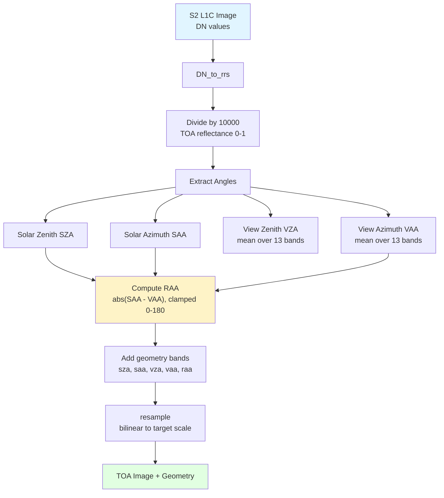
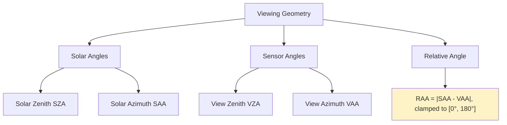
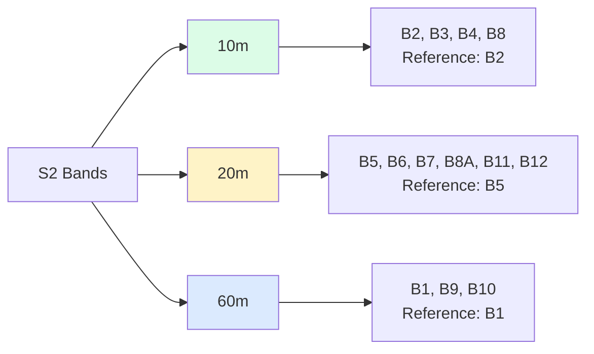
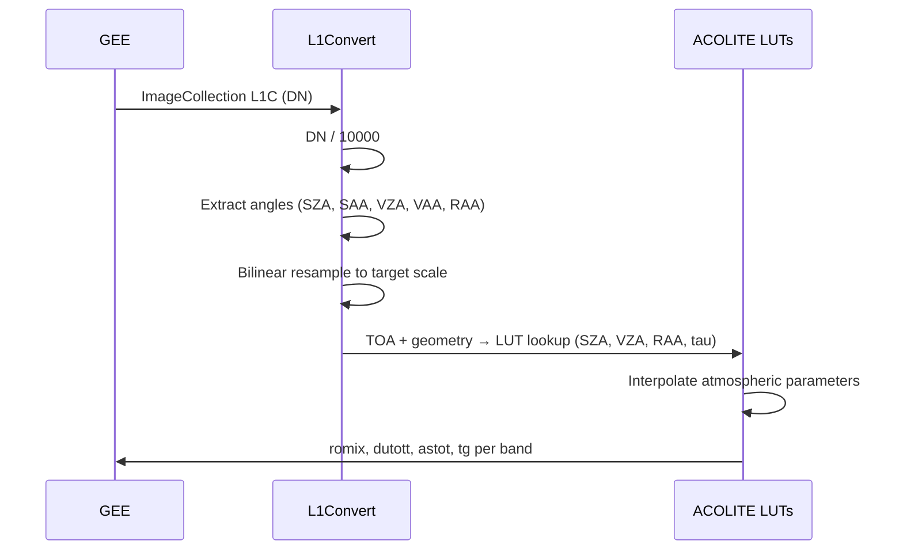

# L1 Conversion

Utilities for converting Sentinel-2 L1C Digital Numbers (DN) to TOA (Top-of-Atmosphere) reflectance, extracting viewing geometry, and resampling bands to a uniform resolution.

## Overview

The `gee_acolite.utils.l1_convert` module:

- Converts DN values to TOA reflectance (`DN / 10000`)
- Extracts solar and sensor viewing angles from image metadata
- Computes the relative azimuth angle (RAA)
- Resamples all bands to a common target resolution

## Conversion Flow



## Functions

::: gee_acolite.utils.l1_convert.l1_to_rrs
    options:
      show_root_heading: true
      show_source: true
      heading_level: 3

::: gee_acolite.utils.l1_convert.DN_to_rrs
    options:
      show_root_heading: true
      show_source: true
      heading_level: 3

::: gee_acolite.utils.l1_convert.resample
    options:
      show_root_heading: true
      show_source: true
      heading_level: 3

## Viewing Geometry

The geometry angles are critical inputs to the ACOLITE LUT interpolation:



### Extracted Angles

| Angle | Output band | Source metadata property | Range |
|-------|-------------|--------------------------|-------|
| Solar Zenith (SZA) | `sza` | `MEAN_SOLAR_ZENITH_ANGLE` | 0°–90° |
| Solar Azimuth (SAA) | `saa` | `MEAN_SOLAR_AZIMUTH_ANGLE` | 0°–360° |
| View Zenith (VZA) | `vza` | Mean of `MEAN_INCIDENCE_ZENITH_ANGLE_B*` (13 bands) | 0°–90° |
| View Azimuth (VAA) | `vaa` | Mean of `MEAN_INCIDENCE_AZIMUTH_ANGLE_B*` (13 bands) | 0°–360° |
| Relative Azimuth (RAA) | `raa` | `|SAA - VAA|`, clamped to [0°, 180°] | 0°–180° |

## Spatial Resolutions

Sentinel-2 MSI has three native resolutions. All bands are resampled to a single target resolution using the reference band for that scale:



### Full Band Table

| Band | Name | Central λ (nm) | Width (nm) | Native res. | Use |
|------|------|----------------|------------|------------|-----|
| B1 | Coastal Aerosol | 443 | 21 | 60m | Aerosol correction |
| B2 | Blue | 492 | 66 | 10m | Ocean, bathymetry |
| B3 | Green | 560 | 36 | 10m | Water quality |
| B4 | Red | 665 | 31 | 10m | SPM, turbidity |
| B5 | Red Edge 1 | 705 | 15 | 20m | Chlorophyll |
| B6 | Red Edge 2 | 740 | 15 | 20m | Vegetation |
| B7 | Red Edge 3 | 783 | 20 | 20m | Vegetation |
| B8 | NIR | 842 | 106 | 10m | Water mask, shadows |
| B8A | Narrow NIR | 865 | 21 | 20m | Water vapour |
| B9 | Water Vapour | 945 | 20 | 60m | Atmospheric correction |
| B10 | Cirrus | 1375 | 31 | 60m | Cirrus detection |
| B11 | SWIR 1 | 1610 | 91 | 20m | Water/land mask, glint |
| B12 | SWIR 2 | 2190 | 175 | 20m | Glint reference |

## Usage Examples

### Full Collection Conversion

```python
import ee
from gee_acolite.utils.search import search
from gee_acolite.utils.l1_convert import l1_to_rrs

ee.Initialize(project='your-project-id')

roi = ee.Geometry.Rectangle([-0.5, 39.3, -0.1, 39.7])
images_l1c = search(roi, '2023-06-15', '2023-06-16', tile='30SYJ')

# Convert to TOA reflectance at 10m
images_toa = l1_to_rrs(images_l1c, scale=10)

# Inspect output bands
band_names = images_toa.first().bandNames().getInfo()
print(band_names)
# ['B1', 'B2', ..., 'B12', 'sza', 'saa', 'vza', 'vaa', 'raa']
```

### Single Image Conversion

```python
from gee_acolite.utils.l1_convert import DN_to_rrs

image_toa = DN_to_rrs(images_l1c.first())

# Access geometry
sza_mean = image_toa.select('sza').reduceRegion(
    ee.Reducer.mean(), roi, 1000
).getInfo()
print(f'Mean SZA: {sza_mean}')
```

## DN to Reflectance Formula

The conversion for Sentinel-2 L1C is:

$$
\rho_{\text{TOA}} = \frac{DN}{10000}
$$

This normalises all band values to the range [0, 1], which is required by the ACOLITE LUT interpolation.

## RAA Computation

The relative azimuth angle is computed from solar and sensor azimuths and clamped to [0°, 180°] to match the LUT indexing:

$$
\text{RAA} = |\phi_s - \phi_v|, \quad \text{if RAA} > 180° \Rightarrow \text{RAA} = 360° - \text{RAA}
$$

## Integration with ACOLITE



## References

- [Sentinel-2 L1C Product Specification (ESA)](https://sentinel.esa.int/documents/247904/349490/S2_MSI_Product_Specification.pdf)
- [GEE COPERNICUS/S2_HARMONIZED Dataset](https://developers.google.com/earth-engine/datasets/catalog/COPERNICUS_S2_HARMONIZED)
