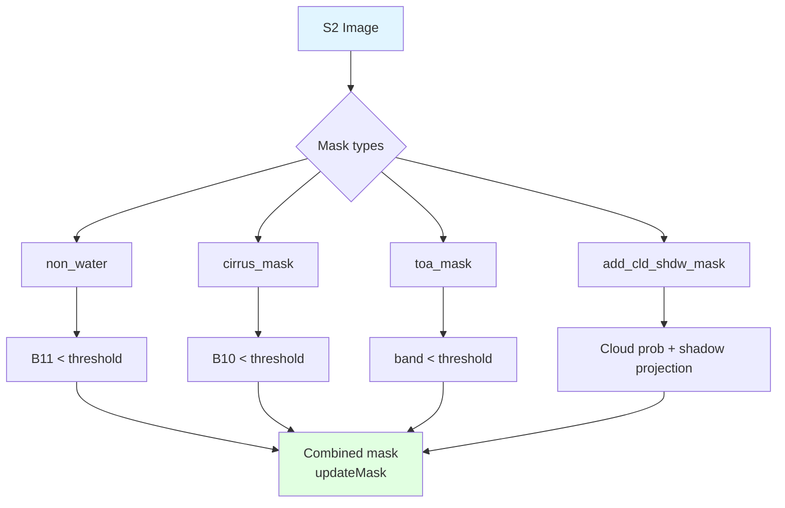
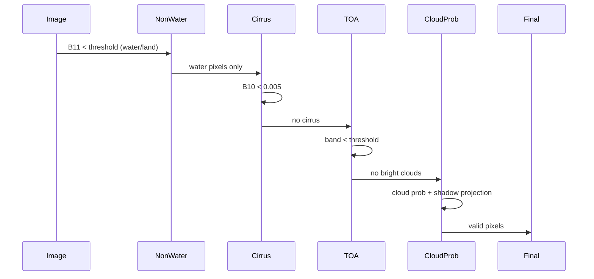
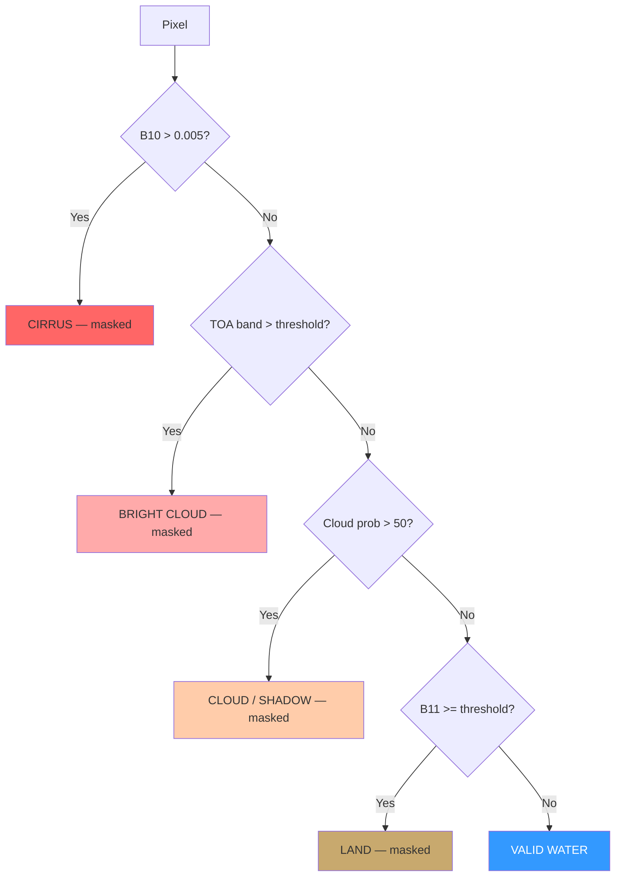

# Quality Masks

Utilities for creating quality masks and filtering Sentinel-2 scenes.

## Overview

The `gee_acolite.utils.masks` module provides functions to create the masks used in quality control of satellite imagery, including:

- Water / land classification
- Cirrus cloud detection
- TOA reflectance cloud threshold
- Cloud probability and shadow detection
- Negative reflectance filtering

## Mask Pipeline



## Functions

::: gee_acolite.utils.masks.mask_negative_reflectance
    options:
      show_root_heading: true
      show_source: true
      heading_level: 3

::: gee_acolite.utils.masks.toa_mask
    options:
      show_root_heading: true
      show_source: true
      heading_level: 3

::: gee_acolite.utils.masks.cirrus_mask
    options:
      show_root_heading: true
      show_source: true
      heading_level: 3

::: gee_acolite.utils.masks.non_water
    options:
      show_root_heading: true
      show_source: true
      heading_level: 3

::: gee_acolite.utils.masks.add_cloud_bands
    options:
      show_root_heading: true
      show_source: true
      heading_level: 3

::: gee_acolite.utils.masks.add_shadow_bands
    options:
      show_root_heading: true
      show_source: true
      heading_level: 3

::: gee_acolite.utils.masks.add_cld_shdw_mask
    options:
      show_root_heading: true
      show_source: true
      heading_level: 3

## Masking Sequence



## Usage Examples

### Basic Water Mask

```python
import ee
from gee_acolite.utils.masks import non_water

image = corrected_images.first()

# Keep pixels where B11 < 0.05 (water)
water_mask = non_water(image, band='B11', threshold=0.05)
image_water = image.updateMask(water_mask)
```

### Cirrus Mask

```python
from gee_acolite.utils.masks import cirrus_mask

# Detect cirrus using B10 (1375 nm)
no_cirrus = cirrus_mask(image, band='B10', threshold=0.005)
image_no_cirrus = image.updateMask(no_cirrus)
```

### Full Combined Mask (as used internally by compute_water_mask)

```python
from gee_acolite.utils import masks

settings = {
    'l2w_mask_threshold': 0.05,
    'l2w_mask_cirrus_threshold': 0.005,
    'l2w_mask_high_toa_threshold': 0.3,
}

# Water / land
mask = masks.non_water(image, 'B11', settings['l2w_mask_threshold'])

# Cirrus
mask = mask.And(masks.cirrus_mask(image, 'B10', settings['l2w_mask_cirrus_threshold']))

# Bright clouds (TOA threshold)
mask = mask.And(masks.toa_mask(image, 'rhot_B4', settings['l2w_mask_high_toa_threshold']))

clean_image = image.updateMask(mask)
```

### Cloud and Shadow Masking (requires search_with_cloud_proba)

```python
from gee_acolite.utils.masks import add_cld_shdw_mask, cld_shdw_mask
from gee_acolite.utils.search import search_with_cloud_proba

images = search_with_cloud_proba(roi, '2023-06-01', '2023-06-30')

def apply_cloud_mask(img):
    img = add_cld_shdw_mask(
        img,
        cloud_prob_threshold=50,
        nir_dark_threshold=0.15,
        cloud_proj_distance=10,
        buffer=50,
    )
    return img.updateMask(cld_shdw_mask(img))

masked = images.map(apply_cloud_mask)
```

## Cloud Detection Decision Tree



## Threshold Reference

| Parameter | Threshold | Description | Mode |
|-----------|-----------|-------------|------|
| `l2w_mask_threshold` | > 0.05 | SWIR B11 water/land split | Conservative |
| `l2w_mask_threshold` | > 0.0 | SWIR B11 — permissive | Turbid waters |
| `l2w_mask_cirrus_threshold` | < 0.005 | B10 cirrus detection | Standard |
| `l2w_mask_cirrus_threshold` | < 0.003 | B10 cirrus detection | Strict |
| `l2w_mask_high_toa_threshold` | < 0.3 | TOA cloud threshold | Conservative |
| `l2w_mask_high_toa_threshold` | < 0.2 | TOA cloud threshold | Strict |
| Cloud probability | < 50 | S2 Cloud Probability | Standard |
| Cloud probability | < 30 | S2 Cloud Probability | Strict |

## NDWI — Water Index

The water/land mask is based on SWIR reflectance (B11). Internally, `non_water` keeps pixels where `B11 < threshold`. For reference, the NDWI index used in some contexts is:

$$
\text{NDWI} = \frac{B3 - B8}{B3 + B8}
$$

- NDWI > 0: likely water
- NDWI < 0: likely land/vegetation

## References

- McFeeters, S. K. (1996). The use of the Normalized Difference Water Index (NDWI) in the delineation of open water features. *IJRS*, 17(7), 1425–1432.
- Martins, V. S., et al. (2017). Assessment of atmospheric correction methods for Sentinel-2 MSI images applied to Amazon floodplain lakes. *Remote Sensing*, 9(4), 322.
