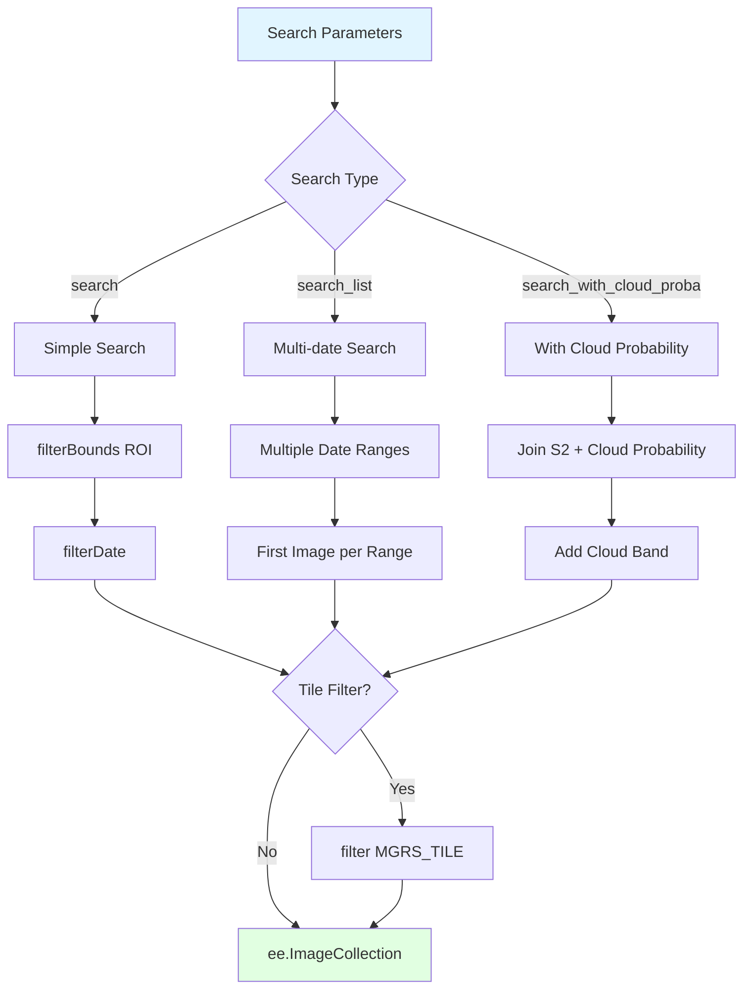
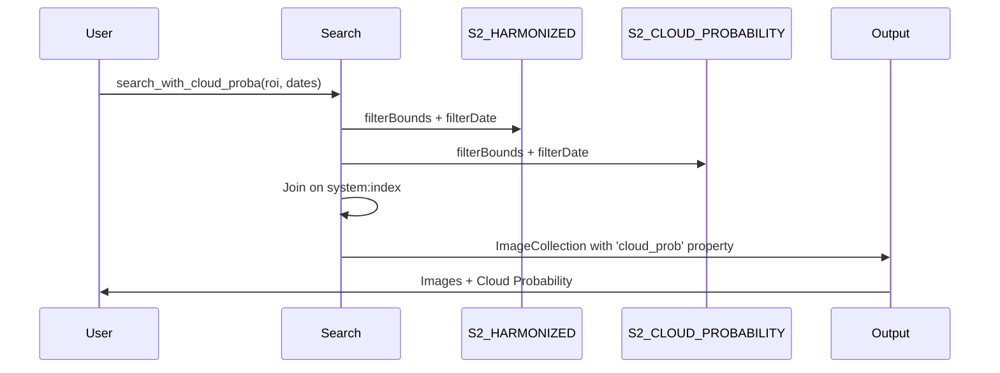

# Image Search

Utilities for searching and retrieving Sentinel-2 imagery from Google Earth Engine.

## Overview

The `gee_acolite.utils.search` module provides simplified functions for searching Sentinel-2 images in the GEE catalog, with filters for region of interest, time range, and specific tile.

## Flow Diagram



## Functions

::: gee_acolite.utils.search.search
    options:
      show_root_heading: true
      show_source: true
      heading_level: 3

::: gee_acolite.utils.search.search_list
    options:
      show_root_heading: true
      show_source: true
      heading_level: 3

::: gee_acolite.utils.search.search_with_cloud_proba
    options:
      show_root_heading: true
      show_source: true
      heading_level: 3

## Available Sentinel-2 Collections

| GEE Collection | Description | Use with gee_acolite |
|----------------|-------------|----------------------|
| `S2_HARMONIZED` | L1C Harmonised (2015–present) | ✅ Recommended |
| `S2` | L1C original (2015–2022) | ⚠️ Deprecated |
| `S2_SR_HARMONIZED` | L2A Harmonised (already corrected) | ❌ Not applicable |
| `S2_SR` | L2A original (already corrected) | ❌ Not applicable |

!!! note "Recommended collection"
    Use `S2_HARMONIZED` for atmospheric correction with ACOLITE. It provides consistent L1C data across Sentinel-2A and 2B and is the actively maintained collection.

## Usage Examples

### Basic Search

```python
import ee
from gee_acolite.utils.search import search

ee.Initialize(project='your-project-id')

roi = ee.Geometry.Rectangle([-0.5, 39.3, -0.1, 39.7])

images = search(
    roi=roi,
    start='2023-06-01',
    end='2023-06-30',
    collection='S2_HARMONIZED',
)

print(f'Images found: {images.size().getInfo()}')
```

### Filter by Specific Tile

```python
# Fix the MGRS tile to avoid duplicate coverage across adjacent tiles
images = search(
    roi=roi,
    start='2023-01-01',
    end='2023-12-31',
    tile='30SYJ',  # Valencia, Spain
)
```

### Search for Specific Dates

```python
from gee_acolite.utils.search import search_list

start_dates = ['2023-03-15', '2023-06-20', '2023-09-10']
end_dates   = ['2023-03-16', '2023-06-21', '2023-09-11']

specific_images = search_list(
    roi=roi,
    starts=start_dates,
    ends=end_dates,
    tile='30SYJ',
)

print(f'Images selected: {specific_images.size().getInfo()}')
```

### Search with Cloud Probability

```python
from gee_acolite.utils.search import search_with_cloud_proba

# Joins S2_HARMONIZED with the S2_CLOUD_PROBABILITY dataset
images = search_with_cloud_proba(
    roi=roi,
    start='2023-06-01',
    end='2023-06-30',
    tile='30SYJ',
)

# Images now carry a 'cloud_prob' property containing the cloud probability image
```

## Cloud Masking Integration



## Sentinel-2 Tile Identifiers

Sentinel-2 tiles follow the MGRS (Military Grid Reference System) naming convention:

**Format:** `[UTM Zone][Latitude Band][100km Square]`

Common examples:

| Tile | Location |
|------|----------|
| `30SYJ` | Valencia, Spain |
| `31TBE` | Barcelona, Spain |
| `29TNE` | Galicia, Spain |
| `30STJ` | Alicante, Spain |

```python
# Find the tile containing a point
def find_tile_at_point(lon, lat):
    point = ee.Geometry.Point([lon, lat])
    sample = (ee.ImageCollection('COPERNICUS/S2_HARMONIZED')
              .filterBounds(point)
              .first())
    return sample.get('MGRS_TILE').getInfo()

valencia_tile = find_tile_at_point(-0.376, 39.470)
print(f'Valencia tile: {valencia_tile}')  # 30SYJ
```

## Pre-filtering by Cloud Cover

```python
# Filter by metadata before running correction (saves getInfo() calls)
images = search(roi, '2023-06-01', '2023-06-30')
images = images.filter(ee.Filter.lt('CLOUDY_PIXEL_PERCENTAGE', 10))
print(f'Images with <10% clouds: {images.size().getInfo()}')
```

## References

- [Sentinel-2 User Handbook](https://sentinel.esa.int/documents/247904/685211/Sentinel-2_User_Handbook)
- [GEE Sentinel-2 Dataset](https://developers.google.com/earth-engine/datasets/catalog/sentinel-2)
- [MGRS Grid Reference System](https://en.wikipedia.org/wiki/Military_Grid_Reference_System)
