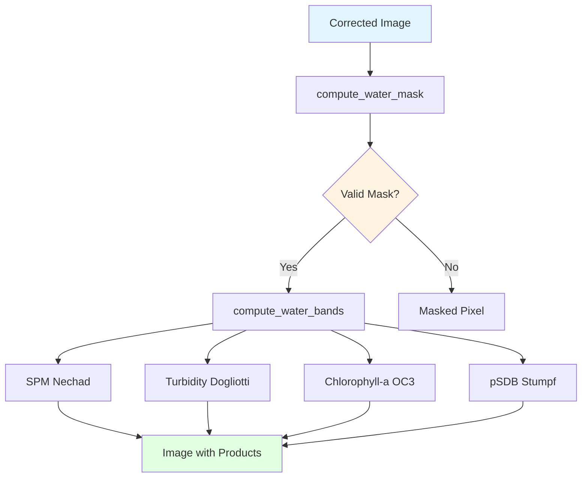
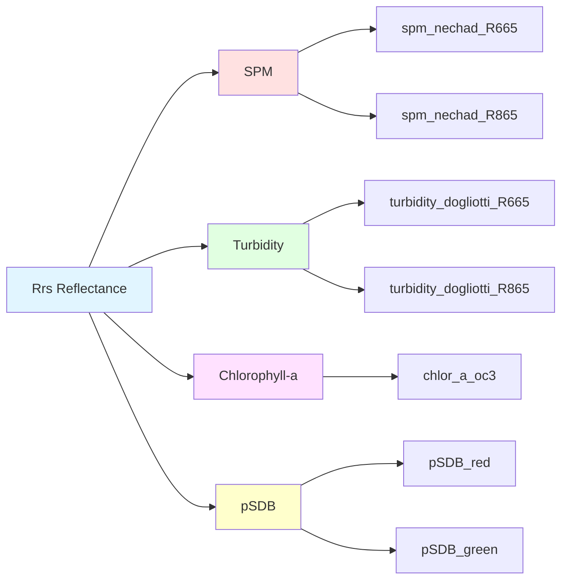

 
# Water Quality

Module to compute water quality parameters from atmospherically corrected images.

## Overview

The `gee_acolite.water_quality` module provides functions to calculate various water quality parameters using atmospherically corrected remote sensing reflectance bands. Includes:

- **SPM**: Suspended Particulate Matter
- **Turbidity**: Water turbidity
- **Chlorophyll-a**: Chlorophyll-a concentration
- **pSDB**: Pseudo-Satellite Derived Bathymetry
- **Quality masks**: To filter invalid pixels

## Flow Diagram



## Available Products



## Main Functions

::: gee_acolite.water_quality.compute_water_mask
        options:
            show_root_heading: true
            show_source: true
            heading_level: 3

::: gee_acolite.water_quality.compute_water_bands
        options:
            show_root_heading: true
            show_source: true
            heading_level: 3

## Individual Products

### SPM (Suspended Particulate Matter)


::: gee_acolite.water_quality.spm_nechad2016_665
        options:
            show_root_heading: true
            show_source: false
            heading_level: 4

### Turbidity

::: gee_acolite.water_quality.tur_nechad2016_665
        options:
            show_root_heading: true
            show_source: false
            heading_level: 4

### Chlorophyll-a

::: gee_acolite.water_quality.chl_oc3
        options:
            show_root_heading: true
            show_source: false
            heading_level: 4

### pSDB (Pseudo-Satellite Derived Bathymetry)

::: gee_acolite.water_quality.pSDB_green
        options:
            show_root_heading: true
            show_source: false
            heading_level: 4


## Product Catalog

::: gee_acolite.water_quality.PRODUCTS
    options:
      show_root_heading: true
      show_source: false
      heading_level: 3

## Usage Example

```python
import ee
from gee_acolite.water_quality import compute_water_bands, compute_water_mask, PRODUCTS

# Atmospherically corrected image
corrected_image = corrected_images.first()

# Create water mask
water_mask = compute_water_mask(corrected_image, settings)

# Compute all water products
water_params = compute_water_bands(
    corrected_image,
    settings,
    products=list(PRODUCTS.keys())
)

# Apply mask
water_params_masked = water_params.updateMask(water_mask)

# Example: get only SPM and Turbidity
selected_products = compute_water_bands(
    corrected_image,
    settings,
    products=['spm_nechad_R665', 'turbidity_dogliotti_R665']
)

# Visualize on map
Map = geemap.Map()
Map.centerObject(roi, 10)
Map.addLayer(water_params_masked.select('spm_nechad_R665'), 
             {'min': 0, 'max': 50, 'palette': ['blue', 'green', 'yellow', 'red']}, 
             'SPM')
```

## Implemented Algorithms

### Nechad et al. (2010) - SPM

Empirical algorithm calibrated for optical sensors:

$$
SPM = A_\lambda \cdot \frac{\rho_w(\lambda)}{1 - \rho_w(\lambda) / C_\lambda}
$$

Where:
- $\rho_w(\lambda)$ = water reflectance
- $A_\lambda$, $C_\lambda$ = band-specific coefficients


### Dogliotti et al. (2015) - Turbidity

Switching algorithm for clear and turbid waters:

$$
Turb = 
\begin{cases}
A_T \cdot \rho_w(\lambda) & \text{if } \rho_w < \rho_{threshold} \\
C \cdot \frac{\rho_w(\lambda)}{1 - \rho_w(\lambda) / D} & \text{if } \rho_w \geq \rho_{threshold}
\end{cases}
$$

### OC3 - Chlorophyll-a

Empirical algorithm based on band ratio:

$$
\log_{10}(Chl-a) = a_0 + a_1 R + a_2 R^2 + a_3 R^3 + a_4 R^4
$$

Where:
$$
R = \log_{10}\left(\frac{\max(Rrs_{443}, Rrs_{492})}{Rrs_{560}}\right)
$$

### Stumpf et al. (2003) - pSDB

Relative bathymetry using logarithmic ratio:

$$
pSDB = m_1 \cdot \frac{\ln(n \cdot Rrs_{\text{blue}})}{\ln(n \cdot Rrs_{\text{red}})} - m_0
$$

## References

- Nechad, B., Ruddick, K. G., & Park, Y. (2010). Calibration and validation of a generic multisensor algorithm for mapping of total suspended matter in turbid waters. Remote Sensing of Environment, 114(4), 854-866.
- Dogliotti, A. I., Ruddick, K. G., Nechad, B., Doxaran, D., & Knaeps, E. (2015). A single algorithm to retrieve turbidity from remotely-sensed data in all coastal and estuarine waters. Remote Sensing of Environment, 156, 157-168.
- Stumpf, R. P., Holderied, K., & Sinclair, M. (2003). Determination of water depth with high‐resolution satellite imagery over variable bottom types. Limnology and Oceanography, 48(1part2), 547-556.
