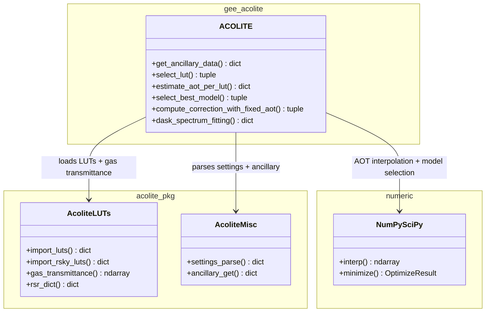
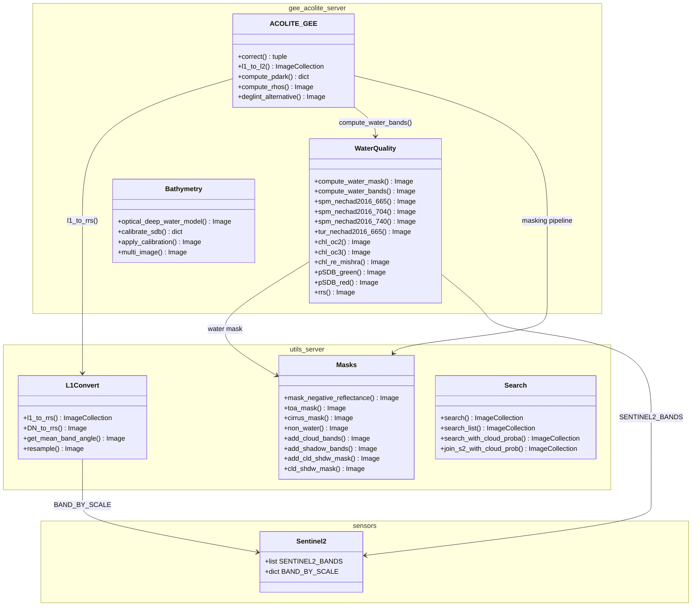
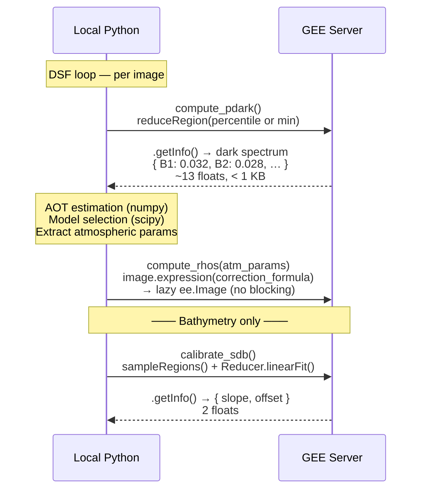
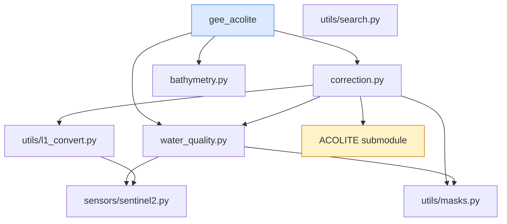
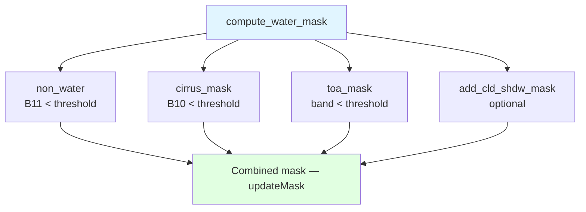

# Class Diagram

Accurate class and module structure of GEE ACOLITE. Organised by **where each component lives**: client (local Python process) or server (GEE cloud).

---

## Client-Side Components

These classes and functions run in the **local Python process**. They block until complete and cannot be deferred to GEE.

### Client Method Responsibilities

| Method | Role |
|--------|------|
| `__load_settings()` | Parse settings via `acolite.acolite.settings.parse()` |
| `get_ancillary_data()` | Fetch pressure/wind/ozone from NASA Earthdata |
| `select_lut()` | Load LUT files from disk for each atmospheric model |
| `estimate_aot_per_lut()` | `np.interp()` — AOT at 550 nm per model, per band |
| `select_best_model()` | RMSD / dtau / CV comparison → best LUT + fixed AOT |
| `compute_correction_with_fixed_aot()` | Extract `romix`, `dutott`, `astot`, `tg` from best LUT |
| `dask_spectrum_fitting()` | Orchestrates DSF: calls `select_lut` → returns atmospheric params |

---

## Server-Side Components

These classes and functions return `ee.Image` / `ee.ImageCollection`. They are **lazy** — no computation runs until `.getInfo()`, `.export()`, or tile rendering is triggered.

### Server Method Responsibilities

| Method | GEE Primitive |
|--------|---------------|
| `correct()` / `l1_to_l2()` | Orchestration — calls `l1_to_rrs` then per-image DSF loop |
| `compute_pdark()` | `reduceRegion(Reducer.percentile)` → **`getInfo()`** bridge |
| `compute_rhos()` | `image.expression()` — applies correction formula per band |
| `deglint_alternative()` | `image.subtract()` + `updateMask()` |
| `non_water()` / `cirrus_mask()` / `toa_mask()` | `B11.lt()` / `B10.lt()` / `band.lt()` |
| `add_cld_shdw_mask()` | `directionalDistanceTransform()`, `focal_min/max()` |
| `spm_nechad2016*` / `tur_nechad2016*` | `image.expression('A*R/(1-R/C)')` |
| `chl_oc2()` / `chl_oc3()` | `image.log()` + polynomial expression |
| `rrs()` | `image.divide(math.pi)` |
| `multi_image()` | `qualityMosaic(band)` |

---

## Client ↔ Server Communication

There are exactly **two points** where the client blocks waiting for GEE to return data:

!!! warning "Performance note"
    `getInfo()` is called **once per image** in `compute_pdark()`. All other GEE operations are lazy and batched. Processing time scales **linearly with the number of images**.

### Data transferred at each bridge point

| Call | Direction | Payload | Blocking |
|------|-----------|---------|----------|
| `compute_pdark().getInfo()` | GEE → Client | 13 floats (dark spectrum) | Yes, per image |
| `calibrate_sdb().getInfo()` | GEE → Client | 2 floats (slope, offset) | Yes, once |
| `compute_rhos(atm_params)` | Client → GEE | 4 floats per band × 13 bands | No (lazy) |

---

## Module Dependency Graph

---

## Water Quality — PRODUCTS Registry

---

## Masking Pipeline

---

## Sentinel-2 Band Configuration

| Band | Wavelength (nm) | Resolution | Role |
|------|----------------|------------|------|
| B1 | 443 | 60m | Coastal aerosol |
| B2 | 490 | 10m | Blue (pSDB numerator) |
| B3 | 560 | 10m | Green |
| B4 | 665 | 10m | Red (SPM, Turbidity) |
| B5 | 705 | 20m | Red Edge 1 (Chl-a NDCI) |
| B6 | 740 | 20m | Red Edge 2 |
| B7 | 783 | 20m | Red Edge 3 |
| B8 | 842 | 10m | NIR (water mask, shadows) |
| B8A | 865 | 20m | Narrow NIR |
| B9 | 945 | 60m | Water vapour |
| B10 | 1375 | 60m | Cirrus detection |
| B11 | 1610 | 20m | SWIR 1 (water/land mask) |
| B12 | 2190 | 20m | SWIR 2 (glint reference) |
