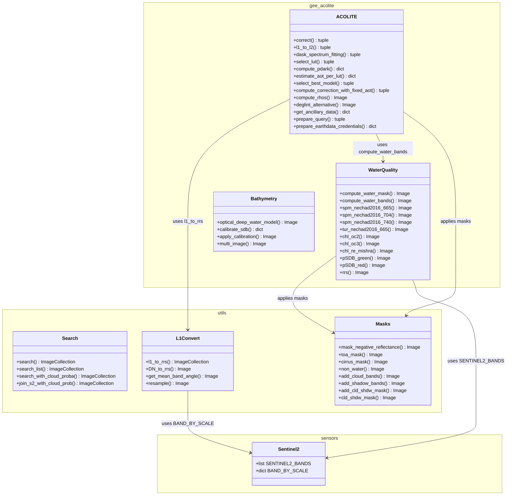
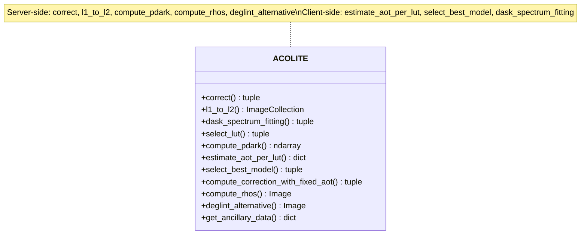
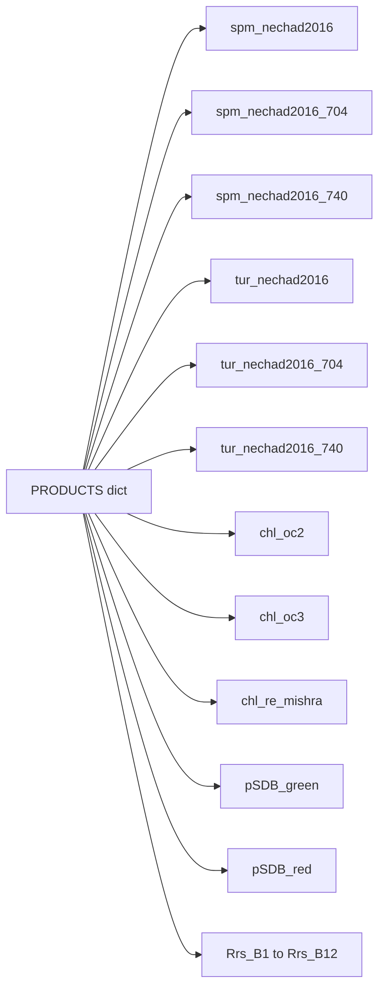
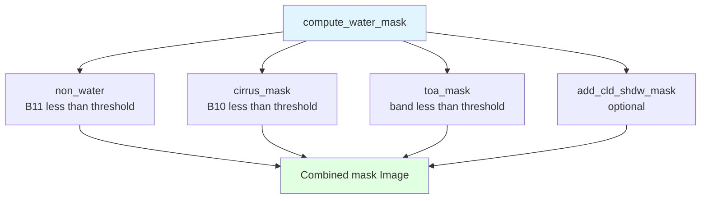
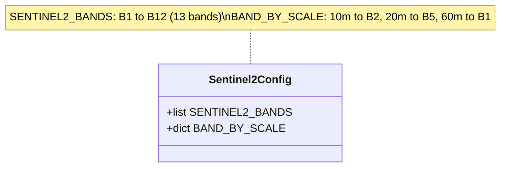
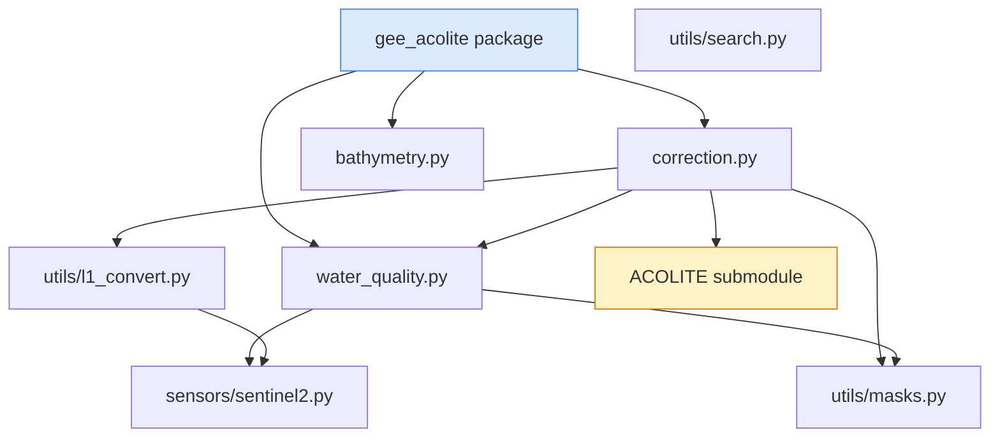

# Class Diagram

Accurate class and module structure of GEE ACOLITE, based on the actual source code.

---

## Full Package Overview

---

## ACOLITE Class — Detailed Methods

### Method Responsibilities

| Method | Execution | Description |
|--------|-----------|-------------|
| `correct()` | Orchestration | Main entry point: calls `l1_to_rrs` then `l1_to_l2` |
| `l1_to_l2()` | Orchestration | Loops over images; calls DSF and `compute_rhos` per image |
| `dask_spectrum_fitting()` | Client | Orchestrates DSF: calls `select_lut` then returns GEE image |
| `select_lut()` | Hybrid | Calls `compute_pdark` (server→client), then estimates AOT (client), then returns atmospheric params |
| `compute_pdark()` | Server → Client | GEE `reduceRegion()` → `getInfo()` — only `getInfo()` per image |
| `estimate_aot_per_lut()` | Client | numpy/scipy LUT interpolation per atmospheric model |
| `select_best_model()` | Client | RMSD/dtau/CV comparison across models |
| `compute_correction_with_fixed_aot()` | Client | Alternative to DSF when AOT is known |
| `compute_rhos()` | Server | GEE image expression: correction formula applied to all bands |
| `deglint_alternative()` | Server | GEE: residual sun glint removal |
| `get_ancillary_data()` | Client | NASA Earthdata API call |

---

## Water Quality Module — PRODUCTS Dictionary

The `PRODUCTS` dict maps product names to their computation functions:

---

## Masking Pipeline

---

## Sentinel-2 Band Configuration

### Band Wavelengths and Resolutions

| Band | Wavelength (nm) | Resolution | Role |
|------|----------------|------------|------|
| B1 | 443 | 60m | Coastal aerosol |
| B2 | 490 | 10m | Blue (pSDB numerator) |
| B3 | 560 | 10m | Green |
| B4 | 665 | 10m | Red (SPM, Turbidity) |
| B5 | 705 | 20m | Red Edge 1 (Chl-a NDCI) |
| B6 | 740 | 20m | Red Edge 2 |
| B7 | 783 | 20m | Red Edge 3 |
| B8 | 842 | 10m | NIR (water mask, shadows) |
| B8A | 865 | 20m | Narrow NIR |
| B9 | 945 | 60m | Water vapour |
| B10 | 1375 | 60m | Cirrus detection |
| B11 | 1610 | 20m | SWIR 1 (water/land mask) |
| B12 | 2190 | 20m | SWIR 2 (glint reference) |

---

## Module Dependency Graph

