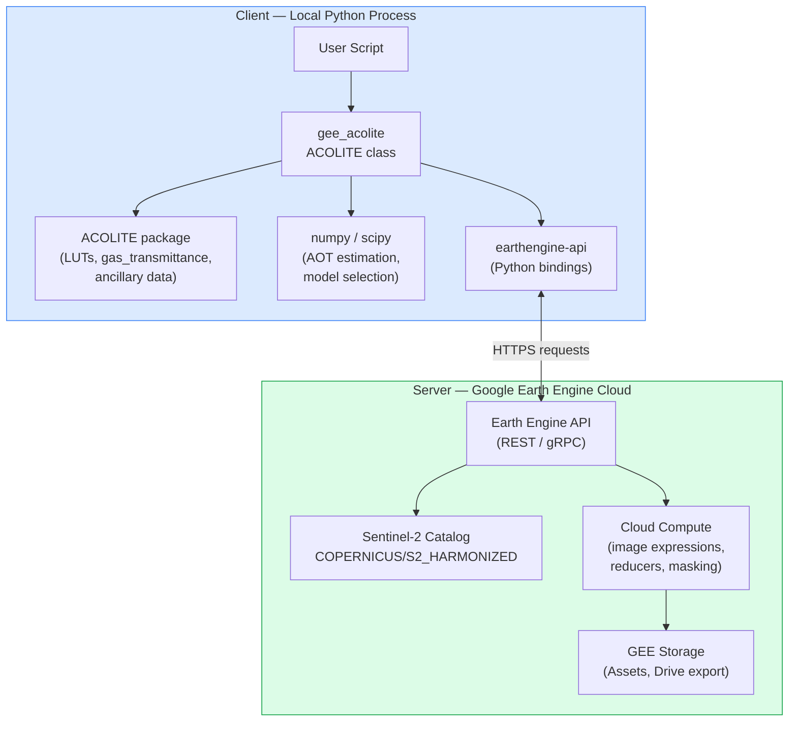
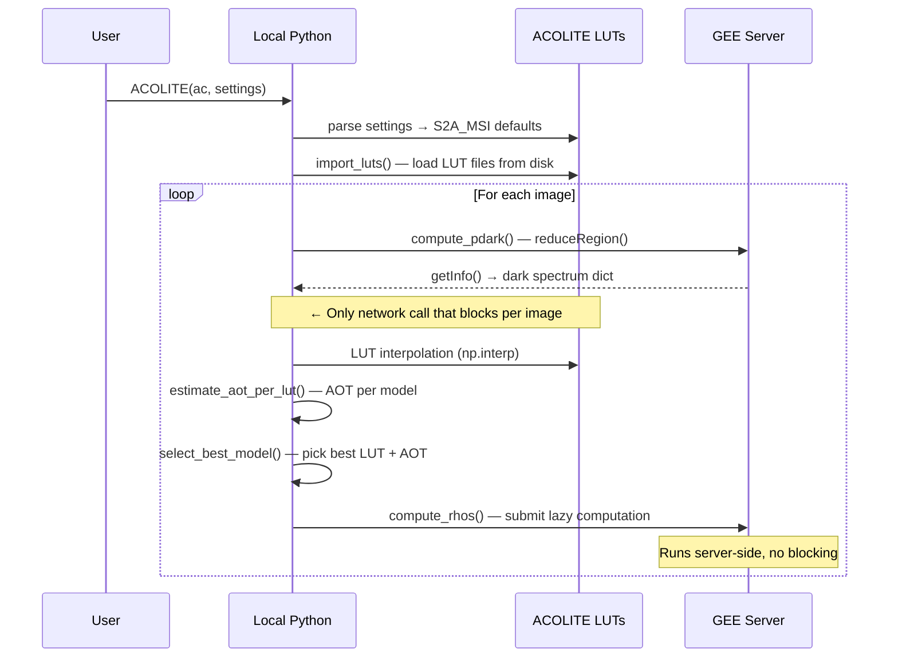
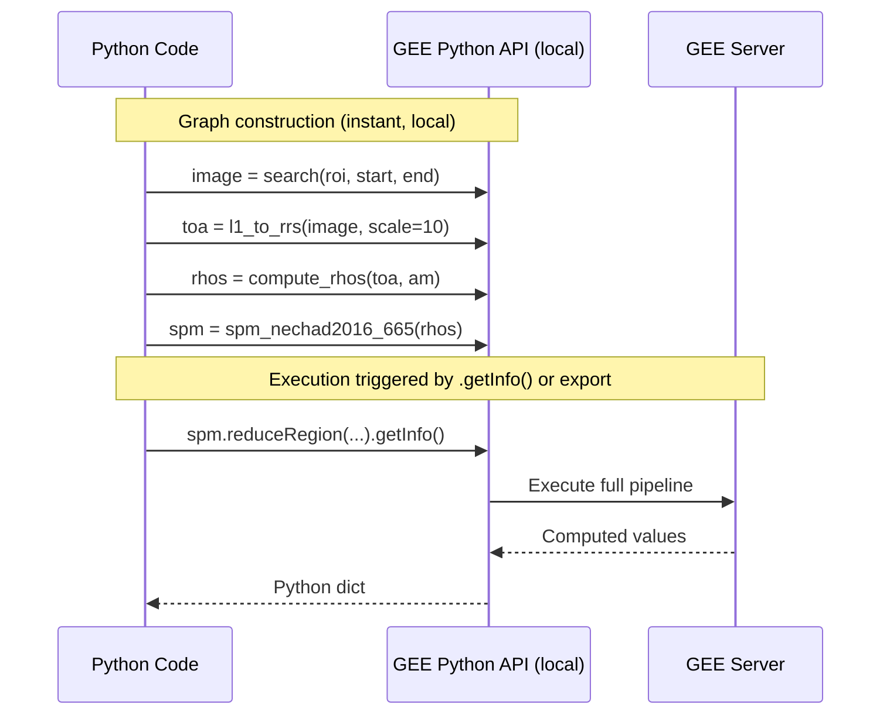
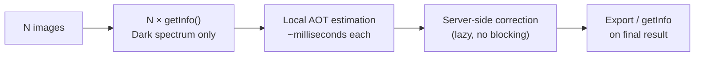
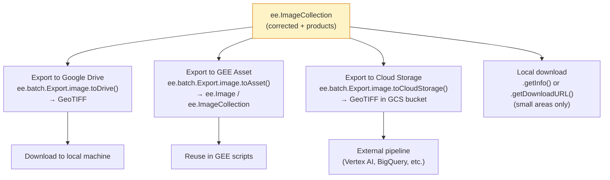

# GEE Integration

How GEE ACOLITE integrates with Google Earth Engine — what runs on the server, what runs on the client, and why.

---

## Architecture Overview

GEE ACOLITE uses a **hybrid processing model** that combines:

- **Client-side (local Python):** ACOLITE LUT loading, AOT estimation, model selection
- **Server-side (GEE cloud):** All image operations, band arithmetic, masking, product computation

This design is necessary because ACOLITE's atmospheric correction requires LUT interpolation that cannot be expressed as a GEE computation graph, while pixel-level image operations benefit from GEE's massive parallelism.



---

## Client vs Server: Operation Classification

### Client-Side Operations

These run in the local Python process and **block until complete**:



| Operation | Function | Why client-side |
|-----------|----------|-----------------|
| Settings parsing | `__load_settings()` | ACOLITE API, not expressible in GEE |
| LUT loading | `import_luts()`, `import_rsky_luts()` | NetCDF files on local disk |
| Gas transmittance | `gas_transmittance()` | ACOLITE spectral model |
| Dark spectrum retrieval | `compute_pdark() → .getInfo()` | Must be a scalar to feed into LUT |
| AOT estimation | `estimate_aot_per_lut()` | numpy LUT interpolation |
| Model selection | `select_best_model()` | numpy/scipy statistics |
| Ancillary data | `get_ancillary_data()` | NASA Earthdata HTTP API |
| SDB calibration readout | `calibrate_sdb() → .getInfo()` | Regression coefficients needed locally |

### Server-Side Operations

These return `ee.Image` or `ee.ImageCollection` objects. They are **lazy** — no computation happens until `.getInfo()`, `.export()`, or tile rendering is triggered.

| Operation | Function | GEE primitive used |
|-----------|----------|--------------------|
| Image search | `search()` | `filterBounds`, `filterDate`, `filter` |
| DN → TOA | `DN_to_rrs()` | `image.divide(10000)` |
| Geometry angles | `get_mean_band_angle()` | `image.get()`, `ee.Number.parse()` |
| Resampling | `resample()` | `resample('bilinear')`, `reproject()` |
| Dark spectrum (send) | `compute_pdark()` | `reduceRegion(Reducer.percentile)` |
| Surface reflectance | `compute_rhos()` | `image.expression(correction_formula)` |
| Negative mask | `mask_negative_reflectance()` | `updateMask(image.gte(0))` |
| Water/land mask | `non_water()` | `B11.lt(threshold)` |
| Cirrus mask | `cirrus_mask()` | `B10.lt(threshold)` |
| Cloud mask | `toa_mask()` | `band.lt(threshold)` |
| Shadow detection | `add_shadow_bands()` | `directionalDistanceTransform()` |
| Shadow mask | `add_cld_shdw_mask()` | `focal_min()`, `focal_max()` |
| Glint correction | `deglint_alternative()` | `image.subtract()`, `updateMask()` |
| SPM / Turbidity | `spm_nechad2016*`, `tur_nechad2016*` | `image.expression()` |
| Chlorophyll OC2/OC3 | `chl_oc2()`, `chl_oc3()` | `image.log()`, polynomial expression |
| Chlorophyll NDCI | `chl_re_mishra()` | `normalizedDifference(['B5','B4'])` |
| pSDB | `pSDB_green()`, `pSDB_red()` | `image.log()` arithmetic |
| Rrs | `rrs()` | `image.divide(math.pi)` |
| Bathymetry mosaic | `multi_image()` | `qualityMosaic(band)` |
| SDB calibration (fit) | `calibrate_sdb()` | `sampleRegions()`, `Reducer.linearFit()` |
| SDB apply | `apply_calibration()` | `image.multiply(slope).add(intercept)` |

---

## GEE Lazy Evaluation

GEE uses **deferred execution**: Python code builds a computation graph but nothing runs until explicitly requested.



**Consequence for gee_acolite:** the correction formula `compute_rhos()` is never actually executed on any pixel during Python execution — only when the result is exported or `.getInfo()` is called by the user.

---

## The getInfo() Bottleneck

The single `getInfo()` per image in `compute_pdark()` is unavoidable but minimised:

```python
# Inside compute_pdark() — the only blocking call per image
pdark = image.reduceRegion(
    reducer=reducer,          # percentile or min
    geometry=image.geometry(),
    scale=settings.get('s2_target_res', 10),
    maxPixels=1e9,
).getInfo()  # ← transfers ~13 float values from GEE to Python
```

The response is a dict of 13 scalar values (one per band), typically < 1 KB. Everything else (the correction, the products, the masking) runs server-side without blocking.



---

## GEE Quotas and Limits

| Resource | Limit | Relevance |
|----------|-------|-----------|
| `getInfo()` memory | 256 MB per call | `compute_pdark()` returns << 1 KB — no issue |
| `getInfo()` timeout | 5 minutes | Unlikely for `reduceRegion` on dark spectrum |
| `reduceRegion` max pixels | 10⁸ (default) | Use `maxPixels=1e9` if needed |
| Concurrent requests | 3000 | Lazy operations do not consume concurrent slots |
| Export max pixels | 10⁹ (Drive/Asset) | Use `maxPixels=1e9` in export tasks |

### Strategies to Stay Within Limits

```python
# 1. Filter images before correction (reduces N × getInfo calls)
images = images.filter(ee.Filter.lt('CLOUDY_PIXEL_PERCENTAGE', 10))

# 2. Use lower scale for testing
settings = {'s2_target_res': 60}  # 36× fewer pixels than 10m

# 3. Clip to actual ROI before export
task = ee.batch.Export.image.toDrive(
    image=result.clip(roi),   # avoids exporting empty tile borders
    scale=10,
    maxPixels=1e9,
    ...
)
```

---

## Export Options



### Recommended Asset Structure

```
projects/your-project/assets/
└── gee_acolite/
    ├── corrected/
    │   ├── roi_2023-06-15        ← single corrected scene
    │   └── roi_2023-07-20
    ├── water_quality/
    │   └── spm_timeseries_2023   ← exported time series
    └── bathymetry/
        ├── psdb_mosaic_2022      ← raw pSDB mosaic
        └── sdb_calibrated_2022   ← calibrated depth map
```

---

## Best Practices

### Minimise `getInfo()` Calls

```python
# Avoid: multiple getInfo() calls in a loop
for i in range(n):
    val = image.select('spm_nechad2016').reduceRegion(...).getInfo()

# Prefer: batch all statistics into one call
stats = corrected.map(
    lambda img: img.set(
        img.select('spm_nechad2016').reduceRegion(
            reducer=ee.Reducer.mean(), geometry=roi, scale=10
        )
    )
)
values = stats.aggregate_array('spm_nechad2016').getInfo()  # one call
```

### Use `scale=60` for Testing

```python
# Quick test with 60m resolution (36× faster than 10m)
settings = {'s2_target_res': 60}
corrected, _ = ac_gee.correct(images)

# Final run with 10m
settings = {'s2_target_res': 10}
corrected, _ = ac_gee.correct(images)
```

### Retry Logic for Transient Errors

```python
import time

def safe_getinfo(ee_object, retries=3):
    for attempt in range(retries):
        try:
            return ee_object.getInfo()
        except ee.EEException as e:
            if attempt < retries - 1:
                time.sleep(2 ** attempt)
            else:
                raise
```

---

## References

- [GEE Python API guide](https://developers.google.com/earth-engine/guides/python_install)
- [GEE Best Practices](https://developers.google.com/earth-engine/guides/best_practices)
- [GEE Quotas](https://developers.google.com/earth-engine/guides/usage)
- [Data Flow](data_flow.md)
- [Class Diagram](class_diagram.md)
