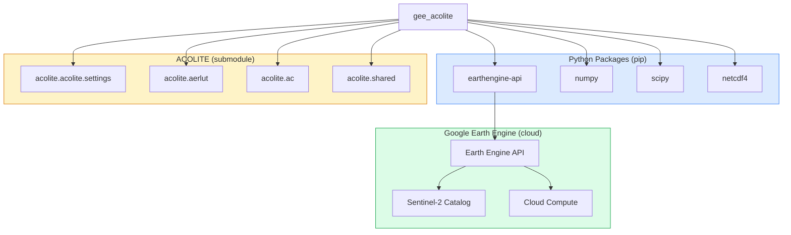

# Dependencies

GEE ACOLITE relies on two categories of dependencies: **Python packages** (declared in `pyproject.toml`) and the **ACOLITE processor** (bundled as a git submodule).

---

## Dependency Graph



---

## Python Packages

### `earthengine-api >= 0.1.350`

The official Google Earth Engine Python client. All server-side operations (image filtering, band arithmetic, reducers, masking) are expressed as GEE API calls that execute lazily on GEE infrastructure.

**Used for:**

- `ee.ImageCollection` — filtering Sentinel-2 catalog by region, date, tile
- `ee.Image.expression()` — DN → TOA reflectance, atmospheric correction formula
- `ee.Reducer.percentile()` / `ee.Reducer.toList()` — dark spectrum extraction (the only `getInfo()` call per image)
- `ee.Reducer.linearFit()` — pSDB calibration regression
- `ee.Image.updateMask()` — water, cloud, cirrus masking
- `ee.batch.Export` — export to Drive / Asset / Cloud Storage

**Install:** `pip install earthengine-api`

---

### `numpy >= 1.20.0`

Used exclusively on the **client side** for numerical operations during AOT estimation.

**Used for:**

- `np.interp()` — interpolating LUT arrays to match observed dark spectrum reflectance values
- `np.argsort()`, `np.mean()`, `np.std()` — sorting and statistical analysis of AOT estimates across LUT models
- Array manipulation for multi-band LUT lookups

---

### `scipy >= 1.7.0`

Used on the **client side** for statistical analysis during the dark spectrum fitting.

**Used for:**

- `scipy.stats.linregress()` — linear regression to estimate the dark spectrum intercept (the `intercept` spectrum option)
- RMSD computation for model selection (`min_drmsd` criterion)

---

### `netcdf4 >= 1.7.0`

Required by the ACOLITE package for reading its atmospheric Look-Up Tables stored in NetCDF format. Not used directly by `gee_acolite` but required at runtime.

---

## ACOLITE (Submodule)

The [ACOLITE processor](https://github.com/acolite/acolite) is bundled as a git submodule in the `ACOLITE/` directory. GEE ACOLITE acts as an **adapter** that extracts the following ACOLITE components for use with GEE imagery:

### `acolite.acolite.settings`

```python
acolite.acolite.settings.parse('S2A_MSI', settings=settings)
```

Parses and validates processing settings (from a file path or dict), merging user-provided values with sensor-specific defaults for Sentinel-2.

### `acolite.aerlut`

```python
acolite.aerlut.import_luts(sensor, settings)
acolite.aerlut.import_rsky_luts(sensor, settings)
```

Loads atmospheric LUT (Look-Up Table) files for the specified sensor. Each LUT is a multidimensional array indexed by:

- **Pressure** (surface atmospheric pressure, hPa)
- **Path reflectance** (`romix`) — reflectance of the atmosphere-surface system
- **Relative azimuth angle** (RAA)
- **Viewing zenith angle** (VZA)
- **Solar zenith angle** (SZA)
- **AOT at 550 nm** (τ₅₅₀)

For each combination, the LUT stores per-band values of:

| Parameter | Symbol | Description |
|-----------|--------|-------------|
| Path reflectance | `romix` | Reflectance of atmosphere alone |
| Total upward transmittance | `dutott` | Combined direct + diffuse transmittance |
| Spherical albedo | `astot` | Back-scattering albedo of atmosphere |
| Gas transmittance | `tg` | Molecular absorption (O₃, H₂O, O₂) |

### `acolite.shared`

```python
acolite.shared.rsr_dict(sensor)
```

Returns the spectral response function (SRF) for each Sentinel-2 band, used to compute band-integrated gas transmittances.

### `acolite.ac`

```python
acolite.ac.gas_transmittance(settings, rsrd)
acolite.ac.ancillary.get(date, lon, lat)
```

- `gas_transmittance`: Computes per-band gas transmittance (O₃, H₂O, O₂, CO₂) given pressure, ozone, and water vapor.
- `ancillary.get`: Fetches ancillary atmospheric data (pressure, ozone, water vapor, wind speed) from NASA Earthdata for a specific date and location.

---

## Optional Dependencies

| Package | Purpose | Install |
|---------|---------|---------|
| `geemap` | Interactive map visualization in Jupyter | `pip install geemap` |
| `matplotlib` | Static plotting of time series / statistics | `pip install matplotlib` |
| `pandas` | Tabular time-series analysis | `pip install pandas` |

---