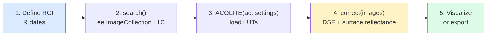

# Quickstart

This guide shows the minimum code needed to run an atmospheric correction on Sentinel-2 imagery using GEE ACOLITE.

---

## Prerequisites

- GEE account and a Cloud Project ID
- `gee_acolite` installed (`pip install gee_acolite`)
- ACOLITE downloaded and its path known (see [Installation](installation.md))

---

## Step 1 — Initialize GEE

```python
import sys
sys.path.append('/path/to/acolite')  # point to your local ACOLITE folder

import ee
import acolite as ac
from gee_acolite import ACOLITE
from gee_acolite.utils.search import search

ee.Initialize(project='your-cloud-project-id')
```

## Step 2 — Define Region and Search Images

```python
# Bounding box: Albufera lagoon, Valencia (Spain)
roi = ee.Geometry.Rectangle([-0.40, 39.27, -0.28, 39.38])

# Search Sentinel-2 L1C Harmonized collection
images = search(
    roi=roi,
    start='2023-06-01',
    end='2023-06-30',
    tile='30SYJ'              # Optional: fix MGRS tile to avoid duplicates
)

# Pre-filter by cloud cover (faster processing)
images = images.filter(ee.Filter.lt('CLOUDY_PIXEL_PERCENTAGE', 15))

print(f"Found {images.size().getInfo()} images")
```

## Step 3 — Configure ACOLITE Settings

```python
settings = {
    # Target spatial resolution for resampling
    's2_target_res': 10,

    # Dark spectrum fitting
    'dsf_spectrum_option': 'darkest',      # 'darkest' | 'percentile' | 'intercept'
    'dsf_model_selection': 'min_drmsd',    # 'min_drmsd' | 'min_dtau' | 'taua_cv'
    'dsf_nbands': 2,                       # Number of darkest bands for AOT fitting

    # Atmospheric conditions (standard; or use ancillary_data=True)
    'pressure': 1013.25,   # hPa
    'uoz': 0.3,            # ozone column, cm-atm
    'uwv': 1.5,            # water vapour, g/cm²
    'wind': 3.0,           # wind speed, m/s

    # Water quality products to compute
    'l2w_parameters': ['spm_nechad2016', 'chl_oc3', 'pSDB_green', 'pSDB_red'],
}
```

## Step 4 — Run Atmospheric Correction

```python
ac_gee = ACOLITE(ac, settings)
corrected, final_settings = ac_gee.correct(images)

print(f"Corrected {corrected.size().getInfo()} images")
print("Output bands:", corrected.first().bandNames().getInfo())
```

!!! info "What happens under the hood"
    For each image, `correct()`:

    1. Converts L1C DNs to TOA reflectance and extracts geometry angles (server-side)
    2. Extracts the dark spectrum via `reduceRegion()` → `getInfo()` (the only client call per image)
    3. Estimates a **single global AOT** using ACOLITE LUTs and numpy/scipy (client-side)
    4. Selects the best atmospheric model (client-side)
    5. Applies the atmospheric correction formula to all bands (server-side)
    6. Computes water quality products and applies masks (server-side)

---

## Step 5 — Visualize with geemap

```python
import geemap

Map = geemap.Map()
Map.centerObject(roi, 11)

first = corrected.first()

# True-colour surface reflectance (RGB)
Map.addLayer(
    first.select(['rhos_B4', 'rhos_B3', 'rhos_B2']),
    {'min': 0, 'max': 0.15, 'gamma': 1.4},
    'Surface Reflectance RGB'
)

# SPM (Suspended Particulate Matter, mg/L)
Map.addLayer(
    first.select('spm_nechad2016'),
    {'min': 0, 'max': 50, 'palette': ['navy', 'blue', 'cyan', 'yellow', 'red']},
    'SPM (mg/L)'
)

# Pseudo-SDB (bathymetry proxy)
Map.addLayer(
    first.select('pSDB_green'),
    {'min': 1.0, 'max': 1.3, 'palette': ['white', 'cyan', 'blue', 'navy']},
    'pSDB green'
)

Map
```

---

## Step 6 — Export to Google Drive

```python
first_image = corrected.first()
date_str = ee.Date(first_image.get('system:time_start')).format('YYYY-MM-dd').getInfo()

task = ee.batch.Export.image.toDrive(
    image=first_image,
    description=f'valencia_{date_str}_corrected',
    folder='GEE_ACOLITE',
    fileNamePrefix=f'valencia_{date_str}',
    region=roi,
    scale=10,
    maxPixels=1e9,
    crs='EPSG:32630',
)
task.start()
print(f"Export task submitted: {task.status()['state']}")
```

---

## Complete Script

```python
import sys
sys.path.append('/path/to/acolite')  # point to your local ACOLITE folder

import ee
import acolite as ac
from gee_acolite import ACOLITE
from gee_acolite.utils.search import search

def main():
    ee.Initialize(project='your-cloud-project-id')

    roi = ee.Geometry.Rectangle([-0.40, 39.27, -0.28, 39.38])

    images = search(roi, '2023-06-01', '2023-06-30', tile='30SYJ')
    images = images.filter(ee.Filter.lt('CLOUDY_PIXEL_PERCENTAGE', 15))
    n = images.size().getInfo()
    print(f"Found {n} images")
    if n == 0:
        return

    settings = {
        's2_target_res': 10,
        'dsf_spectrum_option': 'darkest',
        'dsf_model_selection': 'min_drmsd',
        'pressure': 1013.25,
        'uoz': 0.3,
        'uwv': 1.5,
        'wind': 3.0,
        'l2w_parameters': ['spm_nechad2016', 'chl_oc3', 'pSDB_green'],
    }

    ac_gee = ACOLITE(ac, settings)
    corrected, _ = ac_gee.correct(images)
    print(f"Corrected {corrected.size().getInfo()} images")

    task = ee.batch.Export.image.toDrive(
        image=corrected.first(),
        description='quickstart_corrected',
        folder='GEE_ACOLITE',
        region=roi,
        scale=10,
        maxPixels=1e9,
    )
    task.start()
    print("Export started.")

if __name__ == '__main__':
    main()
```

---

## Typical Workflow



---

## Next Steps

- [Examples](examples.md): Atmospheric correction + bathymetry calibration workflows
- [Configuration](configuration.md): Full reference for all settings parameters
- [API Reference](../api/correction.md): `ACOLITE` class documentation
