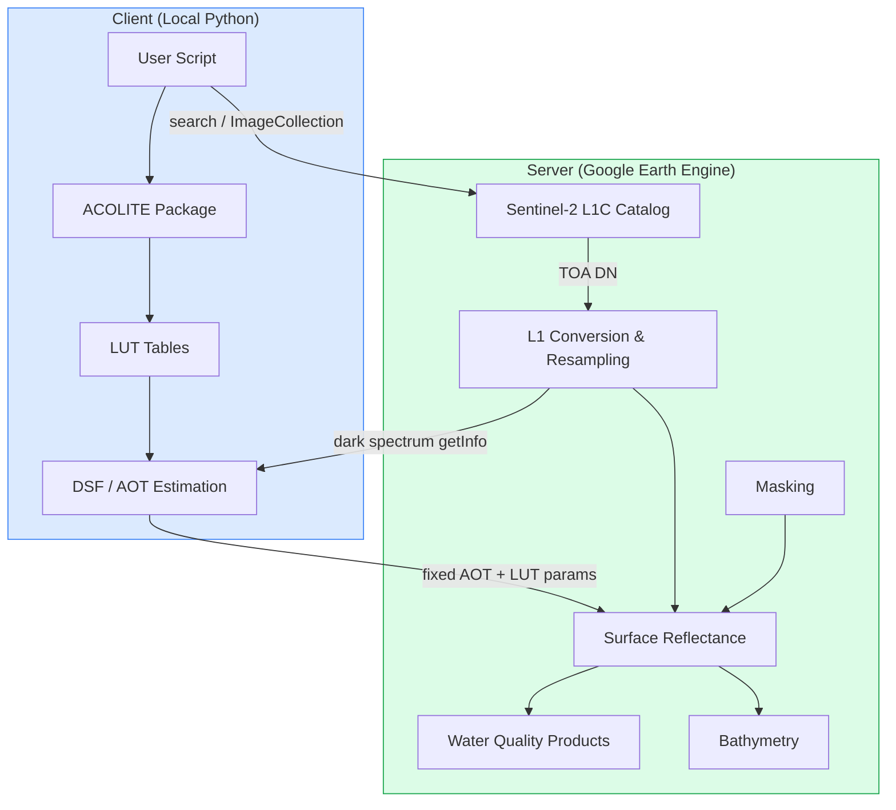
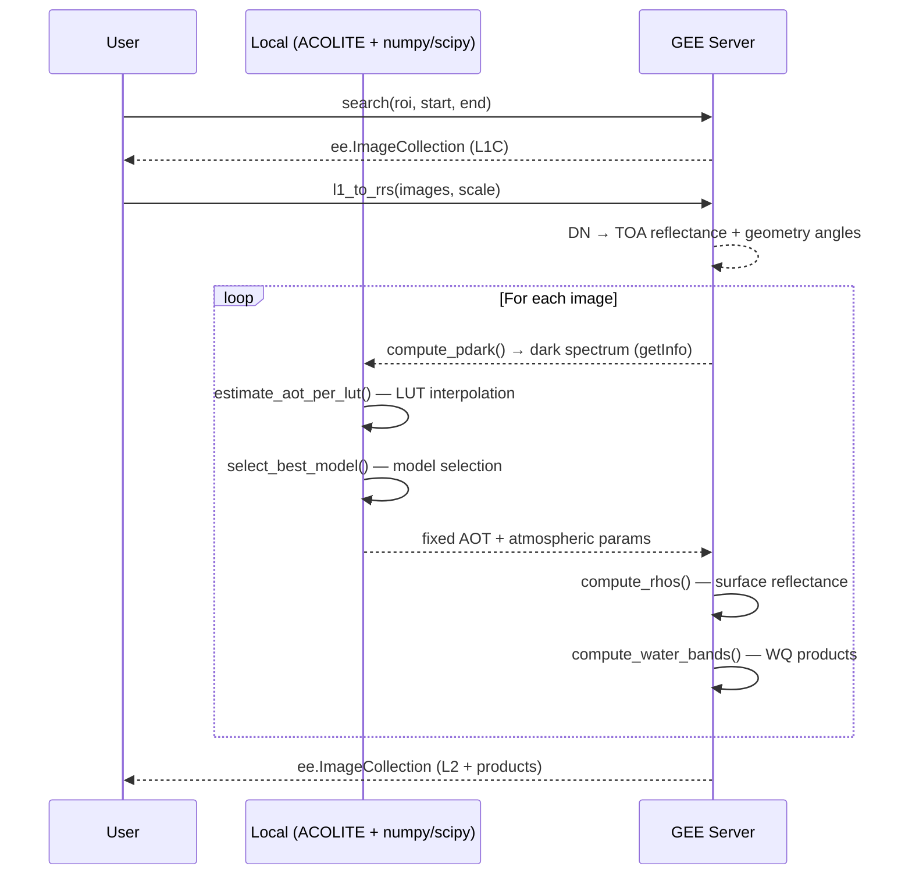

# GEE ACOLITE

**ACOLITE atmospheric correction adapted for Google Earth Engine with Sentinel-2 imagery.**

GEE ACOLITE integrates selected components of the [ACOLITE](https://github.com/acolite/acolite) processor — specifically its Look-Up Tables (LUTs) and Dark Spectrum Fitting (DSF) algorithm — into Google Earth Engine workflows. The key design decision is that AOT (aerosol optical thickness) is estimated as a **single fixed value per image**, making the correction computationally efficient while remaining scientifically rigorous for most aquatic remote sensing applications.

---

## Key Features

- **Dark Spectrum Fitting (DSF)**: Estimates a single global AOT per image using ACOLITE's LUTs and atmospheric models
- **GEE-native processing**: All image operations run server-side on GEE infrastructure; only AOT estimation runs client-side
- **Sentinel-2 support**: Full 13-band support (10m, 20m, 60m), including resampling and geometry extraction
- **Water quality products**: SPM, turbidity, chlorophyll-a (OC2, OC3, NDCI), and remote sensing reflectance (Rrs)
- **Satellite-derived bathymetry**: pSDB indices, optical filtering, and calibration against in-situ data
- **Flexible masking**: Water, cirrus, cloud, and cloud-shadow masks with configurable thresholds

---

## System Architecture



---

## Processing Pipeline



---

## Main Modules

| Module | Description |
|--------|-------------|
| [`gee_acolite.correction`](api/correction.md) | `ACOLITE` class — DSF atmospheric correction |
| [`gee_acolite.water_quality`](api/water_quality.md) | Water quality parameter computation (SPM, turbidity, Chl-a, Rrs) |
| [`gee_acolite.bathymetry`](api/bathymetry.md) | Satellite-derived bathymetry (pSDB, calibration, mosaicking) |
| [`gee_acolite.utils.search`](api/utils/search.md) | Sentinel-2 image search and cloud probability joining |
| [`gee_acolite.utils.l1_convert`](api/utils/l1_convert.md) | L1C DN → TOA reflectance + geometry extraction |
| [`gee_acolite.utils.masks`](api/utils/masks.md) | Water, cloud, cirrus, and shadow masking |
| [`gee_acolite.sensors.sentinel2`](api/sensors/sentinel2.md) | Sentinel-2 band definitions and resolution mapping |

---

## Quick Start

```python
import ee
import acolite as ac
from gee_acolite import ACOLITE
from gee_acolite.utils.search import search

# Initialize GEE
ee.Initialize(project='your-project-id')

# Define region of interest
roi = ee.Geometry.Rectangle([-0.40, 39.43, -0.30, 39.50])

# Search Sentinel-2 L1C images
images = search(roi, '2023-06-01', '2023-06-30', tile='30SYJ')
images = images.filter(ee.Filter.lt('CLOUDY_PIXEL_PERCENTAGE', 10))

# Configure and run atmospheric correction
settings = {
    'dsf_spectrum_option': 'darkest',
    'dsf_model_selection': 'min_drmsd',
    's2_target_res': 10,
    'l2w_parameters': ['spm_nechad2016', 'chl_oc3', 'pSDB_green'],
}
ac_gee = ACOLITE(ac, settings)
corrected, final_settings = ac_gee.correct(images)

# Export to Google Drive
task = ee.batch.Export.image.toDrive(
    image=corrected.first(),
    description='valencia_corrected',
    folder='GEE_ACOLITE',
    region=roi,
    scale=10,
    maxPixels=1e9,
)
task.start()
```

---

## Requirements

- Python >= 3.11
- `earthengine-api >= 0.1.350`
- `numpy >= 1.20`, `scipy >= 1.7`, `netcdf4 >= 1.7`
- ACOLITE (bundled as git submodule)
- Google Earth Engine account

See [Installation](guide/installation.md) for full setup instructions.

---

## License

GPL-3.0-or-later
